GiV - P2
----------  

Abstract
^^^^^^^^
*(NOTA: Un pequeño resumen de lo que habéis hecho, no mas de 200 palabras)*
En aquesta pràctica hem implementat la visualització projectiva (ZBuffer) tant d'escenes virtuals des d'un fitxer com d'escenes de dades geolocalitzades, carregades des d'un fitxer.

Per a tal d'aconseguir-ho hem implementat diferents models de shading: Gouraud, Phong, Toonshading, PhongTextures, NormalMapping, ReflexionsEnvironemtal, RefraccionsEnvironmental... que es poden aplicar localment a diferents objectes d'una mateixa escena carregant les dades de l'objecte i l'escena (càmera i llums) a la GPU novament per a cada objecte.

Features
^^^^^^^^
*(NOTA: Que partes habéis implementado y que miembro del grupo lo ha hecho. Editar la lista que tenéis a continuación añadiendo a continuación del item la persona que ha trabajado en el)*

- Fase 1
    - [Ruben/Manuel] Material
    - Light
        - [Ruben/Manuel ] Puntual
        - [Ruben/Manuel] Direccional
        - [Ruben/Manuel] Spotlight
        - [Ruben/Manuel] Ambient Global
    - Shading
        - [Ruben/Manuel] Phong
        - [Rubén/Manuel ] Gouroud
        - [Manuel] Toon
    - Textures
        - [Rubén ] Textura com material 
        - [Rubén/Manuel ] Mapping indirecte
    - [Albert/Eudald] Data visualization

- Fase 2 
    - [Manuel/Albert/Eudald/Rubén] Animacions amb dades temporals
    - [Manuel/Albert/Eudald] Normal mapping
    - [Albert/Eudald/Rubén] Entorn amb textures
    - [Albert/Eudald] Reflexions
    - [ ] Transparencias via objectes.
    - [Albert/Eudald] Transparencias via environmental mapping.

Extensions
^^^^^^^^^^
**1.** Lectura de materiales desde el fichero de datos .obj [Rubén]. 
El algoritmo te permite leer un material directamente al archivo siguiendo unos parámetros determinados.

**2.** Implementación del cálculo de normales en los vértices a partir partir de la normal de las caras adyacentes.

**3.** Tangentes y bitangentes.[Eudald]
Para hacer un normal mapping de verdad se necessita tener la base de normal, tangente y bitangente en cada vértice. Por lo que se ha añadido un nuevo método en en la classe Object para calcular la tangente y bitangente de cada vértice teniendo encuenta también las coordenadas de textura.

**4.** Lectura de mapa de normales desde el fichero .obj [Eudald].

**5.** Diàleg per crear una escena amb selecció de paràmatres com la textura de pla, gizmo, colormap, i dimensió de l'escena. [Albert i Eudald].

**6.** Per a activar aquest opcional, un cop entrada una escena des de dades s'ha de clicar el botó **obre dades multiples shaders** que fa que es canvia el shader de cada objecte, de la escena oberta des de dades, per a tenir o bé el Phong, Gouraud, Toon Shading de manera que diferents objectes tinguin diferent shader, repetint a partir de numObjectes>3. [Albert]

Screenshots
^^^^^^^^^^^
*(NOTA: Capturas de pantalla de las pruebas que hayáis realizado)*

**Phong Shader**

  
**Gouraud Shader**

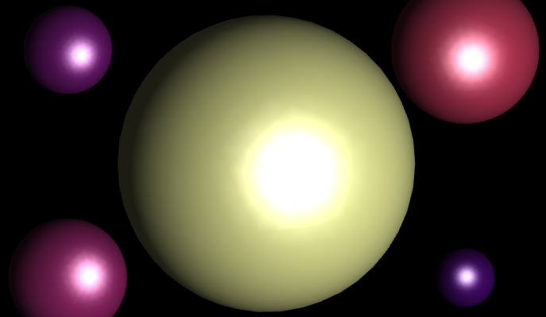

**Toon Shader**

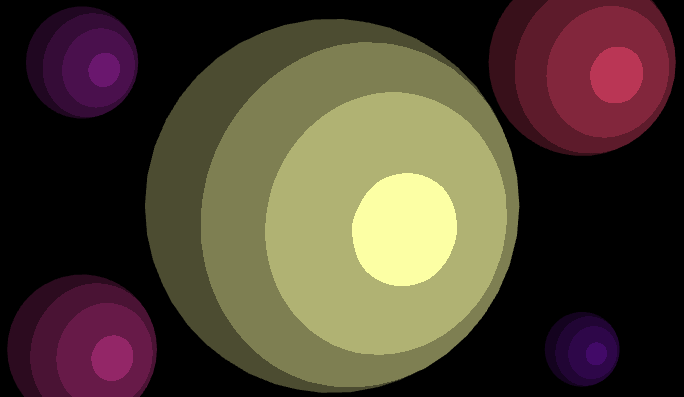
  
**Textura con phong shader en plano**

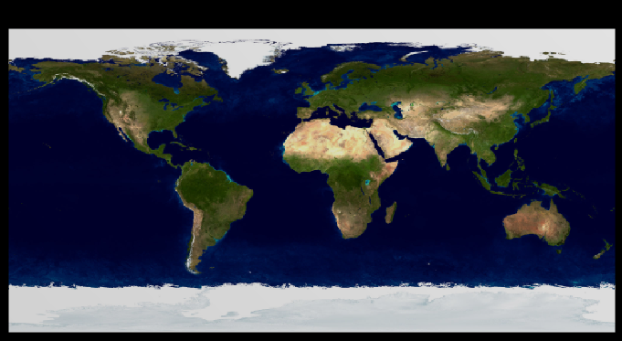
  
**Textura con phong shader en esfera**

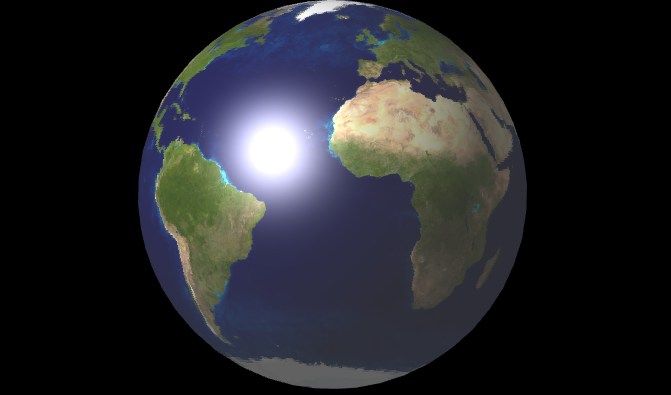
  
**Normal mapping (con tangentes y bitangentes) en esfera**

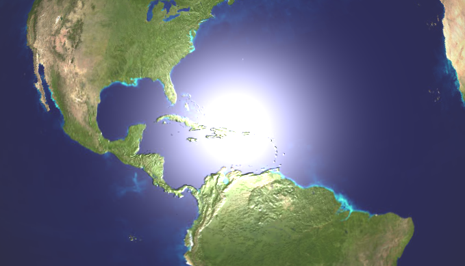
  
**Comparativa de mapeado de textura sin y con mapeado de normales**

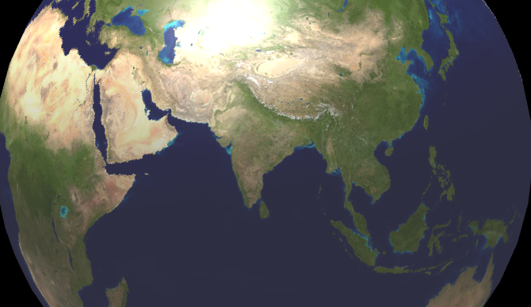
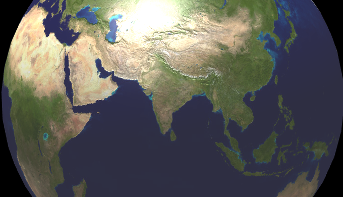
  
**Background Refraction Shader**

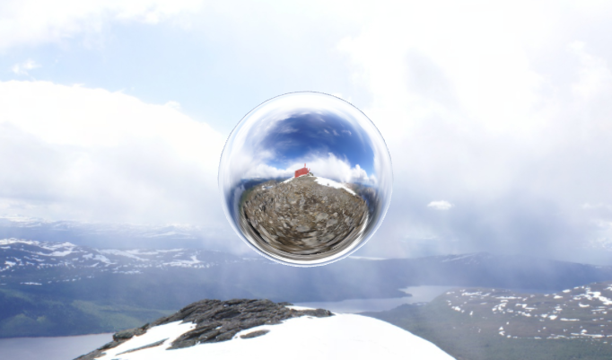
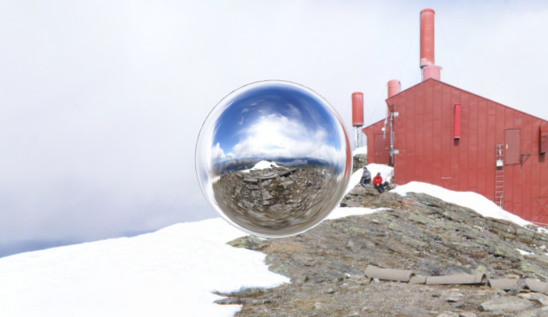

**Background Reflexion/Transparency Shader**

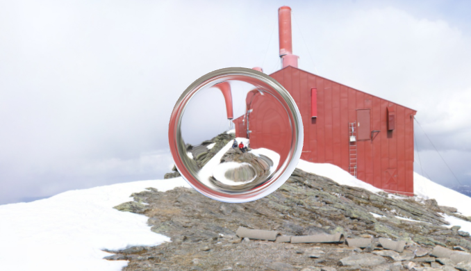
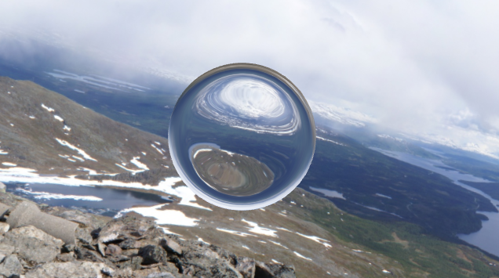

Additional Information
^^^^^^^^^^^^^^^^^^^^^^
*(NOTA: Horas de dedicación y problemas principales que hayáis tenido durante la realización de las prácticas)*

Ruben Ballester [~27h]: La inmensa mayoría de las horas dedicadas a la primera parte de la práctica, en general todas las tareas compartidas con Manu, excepto unas pocas que nos distribuíamos para realizar de forma paralela, pero al final ambos acabábamos haciendo code reviews de la calidad del código del otro para tratar de entregar el mejor proyecto posible (horas no contabilizadas por ninguno de los dos). En la segunda parte, como Manuel, implementación de transformación de objetos y test de la funcionalidad. En la segunda parte configuración del texture background de shaders, cubo, orientación del cubo y implementación de la feature mediante activación/desactivación de shaders en el mismo proceso de pintado (paintGL).

Durante la implementación, afrontamos varios problemas de diseño: especialmente de gestión de flujo de pintado por OpenGL, donde era de máxima prioridad el uso mínimo de recursos para renderizar las escenas en pantalla. Un mal entendimiento del flujo de datos nos llevó en diversas ocasiones a refactorizar el código de envío de datos a GPU hasta su uso pulido. 

Los problemas más complejos de analizar (dependientes de sutilezas) fueron los siguientes:

- Indirect sphere texture mapping: Estabamos aplicando la fórmula correcta pero sin fijarnos que el vector que teníamos no era unitario, cosa que asumíamos que sí porque en general normalizábamos antes del envío a GPU. Hasta que no fuimos estrictos y aplicamos la normalización antes de realizar los cálculos de coordenadas de textura no nos dimos cuenta del error.
-Cambio de shaders y envío de cámara: El background box estaba funcionando bien pero como no enviábamos la cámara correctamente los resultados no eran renderizados de forma correcta. Una vez enviada la cámara correctamente conseguimos tener funcionando el background box sin texturas.

Albert Catalan[~17]:La immensa majoria d'hores dedicades a la segona part de la pràctica. En general totes les tasques compartides amb l'Eudald, excepte algunes poques que ens vam distribuir per realitzar de forma paral·lela. 
De la primera part muntar un nou diàleg d'entrada per a un fitxer de dades i adaptar el codi de la primera pràctica per a poder llegir les dades i crear un pla amb els seus shader sobre el que mostrar-les.
De la segona part implementar animacions a partir de fitxers de text. I els següents opcionals:
- El background, vam continuar la feina que havia fet el Rubén, afegint la textura cubmap, modificant la funció d'assignació de les coordenades de textura, canviant l'orientació i fent les crides necessàries des de paintGL per a que es poguessin pintar els objectes i el background cadascún amb el shader corresponent. 
- Fer que paintGL pogués tenir diferents comportaments i pogués pintar diferents objectes amb diferents shaders, la implementació entregada no és la més elegant però és funcional. Corresponent a l'opcional 5 de la fase 2.
- Environmental relfexion/refraction, seguint les indicacions de classe implementar transparència/refracció d'objectes al background.

Va ser un mal de cap fer proves amb el background perquè si t'allunyaves molt no s'apreciava l'orientació i estant aprop tampoc quedava clar si tots els triangles estaven ben orientats o si hi havia algun problema.

Era incòmode quan, o bé el pla de dades geolocalitzades o bé el backgound es tallaven amb el near plane o el far plane, això, junt amb l'ortogonalitat de la càmera ens van dificultar les comprovcions que realitzavem al principi de la pràctica.

Vam dedicar moltes hores al principi de tot perquè a l'Eudald i a mi no ens compliava un shader que al Rubén i al Manuel si, cosa que ens va desconcertar. Després de moltes hores (6h+ no comptades) i de l'ajuda de tot el grup vam veure que no ens compilava un shader que tenia variables decarades però mai utilitzades.

Eudald Elias[~18h]: El que m'ha donat més maldecap és el "debugging" dels shaders, ja que com que s'executen a la gpu, no pots saber els valors de les variables en un moment donat fácilment.

Els problemes més complexes d'analitzar van ser els següents:
- Mapejat de normals amb tangents i bitangents. Estava aplicant la fòrmula correcte, pero no vaig veure que per fer la mitjana de les tangents i bitangents en cada vertexs estava normalitzant un vec4, cosa que no es correcte ja que es perd la direcció "real". Ho vaig solucionar fent els càlculs amb un vec3. (Normalitzar és més comode que la mitjana, ja que així no has de comptar quans elements tens).
- Background reflection/refraction. El background reflection/refraction ens sortia malament (a mi i a l'Albert). Quan es movia la càmera, la reflecció/refracció tenia efectes molt extranys que no eren realistes. Després de descartat tot el que estava bé, vam veure que en tots els shaders del projecte es passava el vertex en coordenades de pantalla (de pantalla em refereixo a la transformació de vista més la de projecció) en el fragment shader. Mentre que la resta de vectors i posicions de llum es passaven en coordenades de món. També vem veure que la posició de la càmera no es passava correctament.
 

Manuel Lecha[~22h]: La inmensa mayoría de las horas dedicadas a la primera parte de la práctica (Luces, Phong, Tong..), en general todas las tareas compartidas con Ruben. En la segunda parte tan solo animaciones (sin datos, solo objetos) y una primera aproximación a normal mapping pero que luego su implementación final ha sido realizada por mis compañeros Eudald y Albert. Ningún problema a destacar en general.

